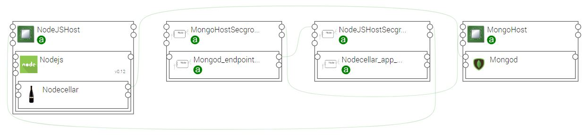

# Alien4cloud security group plugin

This is a topology modifier that will automatically add security groups based on component endpoints of the topology.

## How it works ? 

The plugin contains 2 modifiers that will modify the topology at different deployment phase. 

### The topology Security Groups modifier  

This modifier must be attached before the `pre-node-match` phase. 
It will add a security group and attach it to each `computes` of the topology.

- Each component with a **private** `tosca.capabilities.Endpoint` being linked to a relationship will have an associated security group rule in the security group attached to the hosted `compute`. The generated rule is an ingress rule which allow the source compute to access the target compute through the port defined by the endpoint.
- Each component with a **public** `tosca.capabilities.Endpoint` will have an associated security group rule in the security group attached to the hosted `compute`. The generated rule is an ingress rule which allow everyone (0.0.0.0/0) to access the target compute through the port defined by the endpoint.

The added security groups and security group rules are abstract nodes to be matched with concret nodes at the node matching phase.
 
**At the moment only aws security group and rules are supported.**  

### The Security Groups final modifier

This modifier must be attached at the `post-matched-node-setup` phase. Its goal is to generate the new workflow for the security group nodes.

## Example

#### Given the nodecellar topology:

In this topology:

- Nodecellar has a public endpoint to access the web application on port 8080.
- Nodecellar connects to Mongod through the private endpoint using the port 27017.
 

#### After that the modifier is applied

2 Security groups are added to the topology:

- NodeJSHost_Secgroup which is connected to the NodeJSHost.  
  And it contains a public rule to allow everyone to connect to the nodecellar application on port 8080. 
- MongoHost_Secgroup, connected to the MongoHost.  
  This one contains a rule to allow Nodecellar to connect to the Mongod instance.

